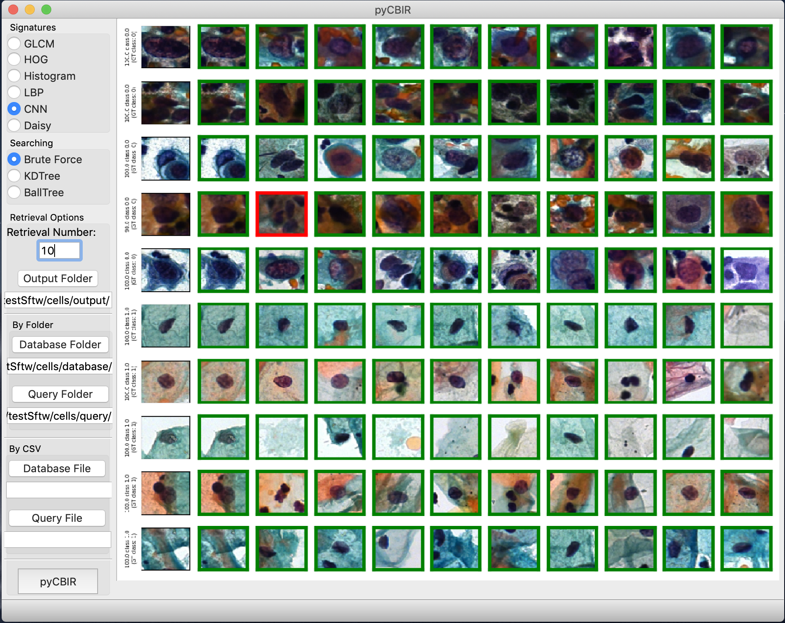

ImageSearch
===========

Search for scientific images using deep learning with [[ImageSearch]](http://bit.ly/aimagesearch)

-	image recommendation system
-	evaluation of feature extraction algorithms
-	user-friendly interface

Basic steps to run image searches:
----------------------------------

-	Install dependencies and activate env:

	`conda env create -n imagesearch -f environment.yml`

	`conda activate imagesearch`

-	Create experiment folders:

	-	*database/*: contains 1 folder per image class
	-	*output/*: contains outputs of models and search results images
	-	*query/*: contains query-images = 1 folder with all or 1 folder per image class

-	Run main file to open user interface:

	`cd src/`

	`python pycbir.py`

-	Need datasets? Download and test in your laptop: [[Cells]](https://drive.google.com/open?id=13Ee5D7IT4ZU63Hext3ZTqtExlRvgmJwM) [[MicroCT]](https://drive.google.com/open?id=13Ee5D7IT4ZU63Hext3ZTqtExlRvgmJwM) [[GISAXs]](http://bit.ly/aimagesearch)

-	It will blow your mind and, with large images, your laptop memory!

More about the project:
-----------------------

### Developers

-	Flavio Araujo
-	Romuere Silva
-	Daniela Ushizima

**Reference us please!** This way we can continue doing social good for free!

Araujo, Silva, Ushizima, Parkinson, Hexemer, Carneiro, Medeiros, **"Reverse Image Search for Scientific Data within and beyond the Visible Spectrum", Expert Systems and Applications** 2018 [[bib]](https://dblp.uni-trier.de/pers/hb/u/Ushizima:Daniela)

This project aims to deploy a compact, yet useful app for content based image retrieval in python. Details about applications to images across domains can be found in this reference [[full paper]](https://www.researchgate.net/publication/325554753_Reverse_image_search_for_scientific_data_within_and_beyond_the_visible_spectrum/figures?lo=1)

Contributing
------------

1.	Fork it!
2.	Create your feature branch: `git checkout -b my-new-feature`
3.	Commit your changes: `git commit -am 'Add some feature'`
4.	Push to the branch: `git push origin my-new-feature`
5.	Submit a pull request :D

History
-------

Version 0.4 (2019-09-28) - compatibility to TensorFlow 2.0.0rc1

License
-------

The MIT License (MIT)

Copyright (c) 2019 Araujo, Silva and Ushizima

Permission is hereby granted, free of charge, to any person obtaining a copy of this software and associated documentation files (the "Software"), to deal in the Software without restriction, including without limitation the rights to use, copy, modify, merge, publish, distribute, sublicense, and/or sell copies of the Software, and to permit persons to whom the Software is furnished to do so, subject to the following conditions:

The above copyright notice and this permission notice shall be included in all copies or substantial portions of the Software.

THE SOFTWARE IS PROVIDED "AS IS", WITHOUT WARRANTY OF ANY KIND, EXPRESS OR IMPLIED, INCLUDING BUT NOT LIMITED TO THE WARRANTIES OF MERCHANTABILITY, FITNESS FOR A PARTICULAR PURPOSE AND NON INFRINGEMENT. IN NO EVENT SHALL THE AUTHORS OR COPYRIGHT HOLDERS BE LIABLE FOR ANY CLAIM, DAMAGES OR OTHER LIABILITY, WHETHER IN AN ACTION OF CONTRACT, TORT OR OTHERWISE, ARISING FROM, OUT OF OR IN CONNECTION WITH THE SOFTWARE OR THE USE OR OTHER DEALINGS IN THE SOFTWARE.

Claims
------

This software contains work partially sponsored by the United States. While this document is believed to contain correct information, neither the United States Government nor any agency thereof, nor the Regents of the University of California, nor any of their employees, makes any warranty, express or implied, or assumes any legal responsibility for the accuracy, completeness, or usefulness of any information, apparatus, product, or process disclosed, or represents that its use would not infringe privately owned rights. Reference herein to any specific commercial product, process, or service by its trade name, trademark, manufacturer, or otherwise, does not necessarily constitute or imply its endorsement, recommendation, or favoring by the United States Government or any agency thereof, or theRegents of the University of California. The views and opinions of authors expressed herein do not necessarily state or reflect those of the United States Government or any agency thereof or the Regents of the University of California.
